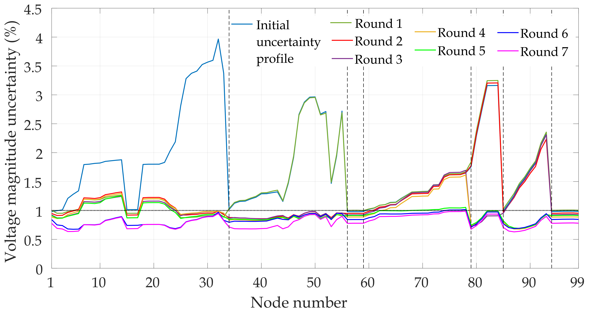

# Codes to perform the analyses presented in the paper "Optimal Meter Placement for Distribution System State Estimation: A Global Sensitivity Analysis-based Framework". 

MAIN ROUTINE: 

File "Main_GSA.m", which allows to replicate the meter placement strategy for state estimation in distribution systems. 

LIST OF MAIN SUBROUTINES contained in "Main_GSA.m":

1) Power_flow_NV: does the power flow calculation for obtaining the reference conditions of the grid

2) sampling_call: makes the call for sampling the inputs

3) NV_DSSE_call: runs the SE algorithm

Be always sure to be in the correct path. MATPOWER, UQLab and Parallel Computing Toolbox™ required.

CREDITS:
David Pacheco (davidpacheco35@hotmail.com), Mirko Ginocchi (mirko.ginocchi@eonerc.rwth-aachen.de), Marco Pau (marco.pau@iee.fraunhofer.de)

MATPOWER: 
R. D. Zimmerman, C. E. Murillo-Sanchez. MATPOWER User-s Manual, Version 7.1. 2020. [Online]. Available: https://matpower.org/docs/MATPOWER-manual-7.1.pdf // Link to the repository: https://github.com/MATPOWER/matpower

UQLAB: 
UQLab: A Framework for Uncertainty Quantification in MATLAB, Stefano Marelli and Bruno Sudret, In The 2nd International Conference on Vulnerability and Risk Analysis and Management (ICVRAM 2014), University of Liverpool, United Kingdom, July 13-16, 2014, pp. 2554–2563. DOI: https://doi.org/10.1061/9780784413609.257. Instruction for UQLab installations: https://www.uqlab.com/  

## Copyright
2022-2023, David Pacheco (RWTH-ACS)  
2018-2024, Mirko Ginocchi (RWTH-ACS)  
2023, Institute for Automation of Complex Power Systems, RWTH Aachen University, Aachen, Germany

## License

 This work is licensed under a <a rel="license" href="http://creativecommons.org/licenses/by/4.0/">Creative Commons Attribution 4.0 International License</a>.

## Funding
</a>&nbsp; 
 
This work was supported by <a rel="Platone" href="https://platone-h2020.eu/">PLATform for Operation of distribution NEtworks </a> (Platone), funded by the European Union's Horizon 2020 research and innovation programme under <a rel="H2020" href="https://cordis.europa.eu/project/id/864300"> grant agreement No. 864300</a>.

## Contact

- [Mirko Ginocchi, M.Sc.](mailto:mirko.ginocchi@eonerc.rwth-aachen.de)

[Institute for Automation of Complex Power Systems (ACS)](http://www.acs.eonerc.rwth-aachen.de)  
[E.ON Energy Research Center (EONERC)](http://www.eonerc.rwth-aachen.de)  
[RWTH University Aachen, Germany](http://www.rwth-aachen.de)

